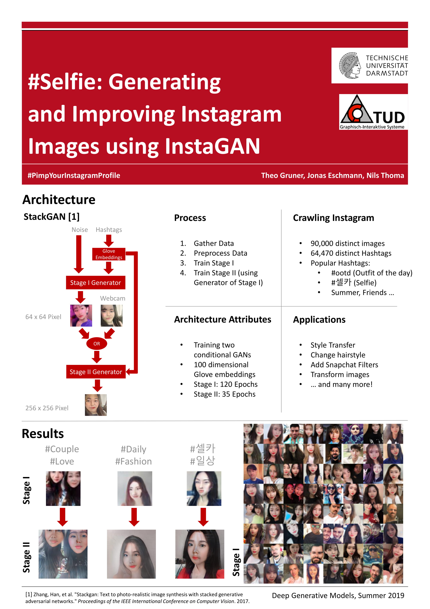

# InstaGAN

InstaGAN generates selfies based on crawled instagram images.
It is based on [StackGAN](https://github.com/hanzhanggit/StackGAN-Pytorch).

# Contributors

- [Jonas Eschmann](https://github.com/jonas-eschmann)
- [Theo Gruner](https://github.com/theogruner)
- [Nils Thoma](https://github.com/Kinetize)

This code was developed during an university project, where we mostly commited as a team through the ''Eschmann'' alias. 
